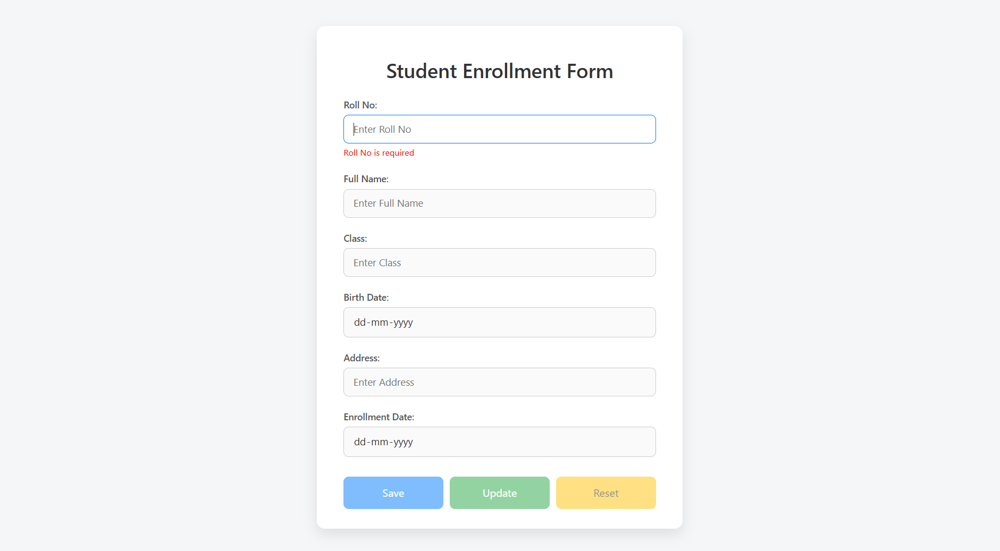

# Student Enrollment Form using JsonPowerDB



## Table of Contents

1. [Description](#description)
2. [Benefits of using JsonPowerDB](#benefits-of-using-jsonpowerdb)
3. [Release History](#release-history)
4. [Illustrations](#illustrations)
5. [Scope of Functionalities](#scope-of-functionalities)
6. [Examples of Use](#examples-of-use)
7. [Project Status](#project-status)
8. [Sources](#sources)
9. [Other Information](#other-information)

## Description

This project is a simple Student Enrollment Form that stores data in STUDENT-TABLE relation of SCHOOL-DB database. It uses JsonPowerDB for the database operations. The form captures student details including Roll No, Full Name, Class, Birth Date, Address, and Enrollment Date.

The form provides the following functionality:

-   Primary key validation (Roll No)
-   Record entry, retrieval, and updating based on Roll No
-   Form field validation to ensure all required data is provided
-   Dynamic form behavior based on whether a record exists or not

## Benefits of using JsonPowerDB

-   **Simplest way to retrieve data in JSON format**: JsonPowerDB returns data in a ready-to-use JSON format.
-   **Schema-free**: It's a schema-free database, making it easy to maintain and adapt to changing requirements.
-   **Serverless**: Supports serverless computing with built-in support for querying on multiple JPDB databases.
-   **Multi-mode database**: Can be used as a document database, key-value database, or geospatial database.
-   **High performance**: Built on PowerIndex, one of the fastest and real-time data indexing engines.
-   **Low development cost**: Easy to develop with minimal coding, reducing development time and cost.
-   **Low learning curve**: Simple to learn and implement with minimal database knowledge.
-   **Human-readable data**: Data is stored in a way that is human-readable.
-   **Real-time database**: JPDB is a real-time database that can be used for high-performance applications.

## Release History

-   **v0.1.0 (June 30, 2025)**: Initial release with basic form functionality for adding and updating student records.

## Illustrations

The Student Enrollment Form consists of:

1. **Form Layout**: A clean, responsive design with labeled input fields.
2. **Control Flow**:
    - On page load, only Roll No field is enabled
    - Once a Roll No is entered and validated:
        - If the record exists: data is populated and Update/Reset buttons are enabled
        - If the record doesn't exist: empty form with Save/Reset buttons enabled
3. **Database Operations**:
    - PUT: To add new student records
    - GET: To retrieve existing student records
    - UPDATE: To modify existing student records

## Scope of Functionalities

Current functionalities include:

-   Adding new student records to the database
-   Retrieving student records based on Roll No
-   Updating existing student records
-   Form validation to ensure data integrity
-   Dynamic form field and button state management

Future enhancements may include:

-   Deletion of records
-   Batch import/export of student data
-   Advanced search and filtering options
-   Student photo uploads
-   Integration with school management systems

## Examples of Use

1. **New Student Registration**:

    - Enter a new Roll No
    - System enables all form fields and the Save button
    - Fill in student details and click Save
    - Record is stored in the database

2. **Update Existing Student**:

    - Enter an existing Roll No
    - System retrieves and displays student data
    - Update necessary fields
    - Click Update to save changes

3. **Form Reset**:
    - Click Reset button at any time
    - Form is cleared and returns to initial state
    - Only Roll No field is enabled

## Project Status

The project is currently in its initial release with core functionalities implemented. Active development is ongoing to add more features and improve the user experience.

## Sources

-   [JsonPowerDB Documentation](http://login2explore.com/jpdb/docs.html)
-   [Bootstrap Documentation](https://getbootstrap.com/docs/3.4/)
-   [jQuery API Documentation](https://api.jquery.com/)

## Other Information

### Prerequisites

-   Web browser with JavaScript enabled
-   Internet connection to access the JsonPowerDB API

### How to Use

1. Clone or download the repository
2. Open `index.html` in a web browser
3. Use the form to add or update student records

### Technical Architecture

-   **Frontend**: HTML, CSS (Bootstrap), JavaScript (jQuery)
-   **Database**: JsonPowerDB
-   **API Endpoints**:
    -   PUT API: `/api/iml`
    -   GET API: `/api/irl`

### Data Model

The Student data is stored with the following structure:

```json
{
    "rollNo": "string",
    "fullName": "string",
    "class": "string",
    "birthDate": "date",
    "address": "string",
    "enrollmentDate": "date"
}
```
